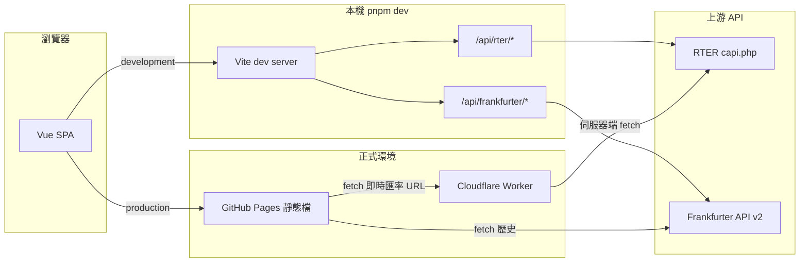

# exchange-rate

單頁應用（Vue 3 + Vite）：即時匯率列表／跑馬燈、雙幣換算、歷史匯率走勢（Chart.js）。資料來自 **RTER**（即時）與 **Frankfurter**（歷史）；GitHub Pages 靜態託管，即時匯率需搭配 **Cloudflare Worker** 代理以避免瀏覽器 CORS。

## 目錄

- [架構與資料流](#架構與資料流)
- [目錄與模組](#目錄與模組)
- [技術堆疊](#技術堆疊)
- [外部 API 與出處](#外部-api-與出處)
- [本機開發](#本機開發)
- [建置與預覽](#建置與預覽)
- [部署：GitHub Pages](#部署github-pages)
- [部署：Cloudflare Worker（RTER 代理）](#部署cloudflare-workerrter-代理)
- [驗證與常見錯誤](#驗證與常見錯誤)
- [免責聲明](#免責聲明)

---

## 架構與資料流



- **即時匯率**：`src/services/exchangeRateApi.ts` → 開發時走 Vite **同源**代理 `/api/rter/capi.php`；正式建置依 `VITE_RTER_LIVE_URL` 指向 **Worker**，未設定則嘗試直連 RTER（瀏覽器常因 CORS 失敗）。
- **歷史匯率**：`src/services/frankfurterApi.ts` → 開發時代理至 `api.frankfurter.dev`；生產直接請求 `https://api.frankfurter.dev`（該服務回應 CORS，無需 Worker）。
- **狀態**：Pinia stores（如 `src/stores/exchangeRate.ts`、`history.ts`）；**路由**：`src/router/index.ts`（`createWebHistory(import.meta.env.BASE_URL)` 與 GitHub Pages 子路徑一致）。

---

## 目錄與模組

| 路徑 | 說明 |
|------|------|
| `src/main.ts` | 建立 Vue app、Pinia、Router |
| `src/App.vue` | 根版面、導覽等 |
| `src/views/HomeView.vue` | 首頁單頁區塊（錨點 `#rates` `#converter` `#history`） |
| `src/components/` | UI 區塊（換算、匯率表、跑馬燈、歷史圖等） |
| `src/stores/` | Pinia：即時匯率、歷史資料等 |
| `src/services/exchangeRateApi.ts` | 即時匯率 HTTP 與資料正規化 |
| `src/services/frankfurterApi.ts` | 歷史匯率 `GET /v2/rates` |
| `src/composables/` | 可複用邏輯（換算、斷點等） |
| `workers/rter-proxy/` | Cloudflare Worker：轉發 RTER + CORS |
| `.github/workflows/deploy.yml` | Pages 建置與 `VITE_*` 注入 |

---

## 技術堆疊

實際版本以 **`package.json`** 與 **`pnpm-lock.yaml`** 為準。

| 類別 | 技術 |
|------|------|
| 執行環境 | 瀏覽器（ESM） |
| 框架 | Vue 3、Vue Router 4 |
| 狀態 | Pinia 2 |
| 建置 | Vite 5、`@vitejs/plugin-vue`、TypeScript、`vue-tsc` |
| 樣式 | Tailwind CSS 3、PostCSS、Autoprefixer |
| 圖表 | Chart.js 4、vue-chartjs 5 |
| 字型 | `@fontsource/inter`、`@fontsource/geist-sans` |
| 邊緣代理 | Cloudflare Workers（Wrangler，見 `workers/rter-proxy`） |
| CI | GitHub Actions（`pnpm`、Node 20、`actions/deploy-pages`） |

---

## 外部 API 與出處

| 用途 | Development（瀏覽器請求） | Production（瀏覽器請求） | 實作 | 出處／說明 |
|------|---------------------------|---------------------------|------|------------|
| 即時匯率（對 USD 報價 JSON） | `GET /api/rter/capi.php`（Vite 代理至右欄） | `GET <VITE_RTER_LIVE_URL>`（**建議**為 Worker URL）或 fallback `https://tw.rter.info/capi.php` | [`src/services/exchangeRateApi.ts`](src/services/exchangeRateApi.ts) | 端點：<https://tw.rter.info/capi.php>（第三方，無官方文件連結時以端點為準） |
| 即時匯率（代理／CORS） | 不需要；由 Vite 同源代理 | **Cloudflare Worker** `workers/rter-proxy` 轉發上列 RTER 並加 CORS | [`workers/rter-proxy/src/index.ts`](workers/rter-proxy/src/index.ts) | [Cloudflare Workers](https://developers.cloudflare.com/workers/) |
| 歷史匯率（日線序列） | `GET /api/frankfurter/v2/rates?...`（代理） | `GET https://api.frankfurter.dev/v2/rates?...` | [`src/services/frankfurterApi.ts`](src/services/frankfurterApi.ts) | 文件與 API 基底：<https://frankfurter.dev/> · 基底 URL：<https://api.frankfurter.dev> |

**Vite 代理設定**（開發用）：[`vite.config.ts`](vite.config.ts) 中 `server.proxy` 將 `/api/rter` 轉到 `https://tw.rter.info`，`/api/frankfurter` 轉到 `https://api.frankfurter.dev`。

---

## 本機開發

需求：**Node.js**（建議與 CI 一致之 20）、**pnpm**。

```bash
pnpm install
pnpm dev
```

預設 <http://localhost:5173>。不需設定 `VITE_BASE`（預設 `/`）。

---

## 建置與預覽

```bash
pnpm build
pnpm preview
```

模擬正式站並指定 Worker（與 CI 相同變數名）：

**PowerShell**

```powershell
$env:VITE_RTER_LIVE_URL="https://你的Worker.workers.dev"
pnpm build
pnpm preview
```

**cmd**

```cmd
set VITE_RTER_LIVE_URL=https://你的Worker.workers.dev&& pnpm build && pnpm preview
```

---

## 部署：GitHub Pages

1. 儲存庫 **Settings → Pages**：**Source** 選 **GitHub Actions**（勿誤選僅從分支部署，除非刻意）。
2. 推送 `main` 或到 **Actions** 手動執行 **Deploy to GitHub Pages**。
3. 部署完成後在 **Settings → Pages** 查看站點網址。

### 網址與 `VITE_BASE`

| 儲存庫類型 | 範例網址 | 建置時 `VITE_BASE`（workflow 自動設定） |
|------------|----------|----------------------------------------|
| 一般專案（Project site） | `https://<user>.github.io/<repo>/` | `/<repo>/` |
| `<user>.github.io` 使用者／組織站 | `https://<user>.github.io/` | `/` |

`deploy.yml` 於建置步驟注入：

- `VITE_BASE`：見上表。
- `VITE_RTER_LIVE_URL`：`${{ secrets.VITE_RTER_LIVE_URL || vars.VITE_RTER_LIVE_URL }}`（Secret 優先於 Variable）。

未設定 `VITE_RTER_LIVE_URL` 時，即時匯率會 fallback 直連 RTER，在瀏覽器通常 **CORS 失敗**；請完成下方 Worker 與 GitHub 變數。

---

## 部署：Cloudflare Worker（RTER 代理）

靜態站無法替瀏覽器解 CORS；請部署 `workers/rter-proxy`，並讓正式建置帶入 `VITE_RTER_LIVE_URL`。

### `Origin` 與網址列不同

瀏覽器的 **`Origin`** 只有「協定 + 主機 + 埠」，**不含路徑**。

| 網址列範例 | 寫入 `ALLOWED_ORIGINS` 的 Origin |
|------------|----------------------------------|
| `https://user.github.io/exchange-rate/` | `https://user.github.io` |
| `http://localhost:5173/...` | `http://localhost:5173` |

若使用 **自訂網域**，請加入該網域的 `https://...` Origin。勿把 `https://user.github.io/repo` 整段當成一項。

### A. 部署 Worker

1. [Cloudflare Dashboard](https://dash.cloudflare.com) 登入。
2. 在本 repo：

   ```bash
   cd workers/rter-proxy
   pnpm install
   npx wrangler login
   ```

3. 編輯 [`workers/rter-proxy/wrangler.toml`](workers/rter-proxy/wrangler.toml)：`[vars] ALLOWED_ORIGINS` 至少含本機與 GitHub Pages 之 Origin（逗號分隔）；`*` 僅供除錯。
4. `pnpm deploy`，記下 Worker 的 `https://....workers.dev` URL。

### B. GitHub Secret 或 Variable

**Settings → Secrets and variables → Actions**：

- **Secrets** 或 **Variables** 擇一新增：`VITE_RTER_LIVE_URL` = Worker 完整 HTTPS URL（通常無額外 path）。
- `VITE_*` 會編進前端，用 Secret 僅為介面隱藏，非加密需求。

設定後需再跑 **Deploy to GitHub Pages**，靜態檔才會內嵌正確 API 位址。

### C. 與 workflow 一致性

- Pages 的 **`VITE_BASE`** 由 workflow 自動設定，不必手動重複設 `VITE_BASE`，除非要覆寫。
- 即時匯率程式邏輯見 [`exchangeRateApi.ts`](src/services/exchangeRateApi.ts) 之 `resolveRterFetchUrl()`。

---

## 驗證與常見錯誤

| 現象 | 可能原因 |
|------|----------|
| CORS 錯誤（即時匯率） | Worker 未部署、`ALLOWED_ORIGINS` 與實際 Origin 不符、或未設 `VITE_RTER_LIVE_URL` 導致直連 RTER。 |
| 404 | Worker URL 錯誤、少 `https`、或路徑與 Worker 路由不一致。 |
| 本機正常、上線不行 | 上線依賴 Worker + 建置變數；本機使用 Vite proxy。 |

**建議**：開發者工具 → **Network** → 即時匯率請求應指向 **Worker 網域**（200），且 Response 含 `access-control-allow-origin`。

---

## 免責聲明

- 本專案為技術示範與個人學習用途；畫面上之匯率、換算結果與歷史走勢**僅供一般參考**，**不構成**投資、換匯、稅務或任何專業建議。
- 數值來自第三方服務（見上文 [外部 API 與出處](#外部-api-與出處)），其**正確性、即時性、完整性與服務可用性**皆非本專案所能保證；供應商可能變更、中斷或限制存取，恕不另行通知。
- 您因使用或信賴本專案所載資訊而採取之任何行為與後果，**請自行評估與承擔風險**；專案維護者與貢獻者**不對**任何直接、間接或衍生之損失負責。
- 若需實際交易或決策，請以金融機構、主管機關或專業顧問之正式資訊為準。
